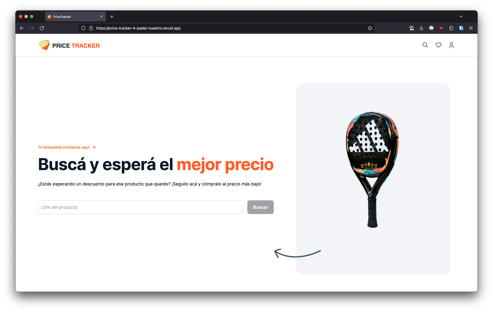

# 
 Welcome to PriceTracker for Padel Nuestro.

## Table of Contents

- [Description](#description)
- [Motivation](#motivation)
- [Built with](#built-with)
- [Concepts & Tools](#concepts-&-tools)
- [Credits](#credits)
- [Future Ideas](#future)
- [Demo](#demo)

## Description

Simple website that tracks prices from Padel Nuestro store and let you know information in your email like:

- The product is in stock again
- The price goes down
- Average price fluctuation
- Discounts

Products are check every day at 10am (GMT-3)

## Motivation

As an amateur padel player, I was always interested in having the best equipment or being aware of the latest offers. While learning Next.js I decided to create this website to receive discounts on the products that interest me, follow them and see when is the best time to buy them! Directly to my inbox.

## Built with

- [NextJS 14](https://nextjs.org/) Framework.
- Typescript
- Tailwind CSS
- MongoDB

## Concepts & Tools

- [React Responsive Carousel](https://www.npmjs.com/package/react-responsive-carousel)
- [Cheerio](https://www.npmjs.com/package/cheerio)
- [Axios](https://www.npmjs.com/package/axios)
- [Headless UI](https://headlessui.com/react/transition) (Modal-transitions)
- [Nodemailer](https://www.npmjs.com/package/nodemailer) (working with cron job)
- [React-toastify](https://fkhadra.github.io/react-toastify/introduction/) for toast messages
- React Server & Client Components
- Git flow & Control
- Cron Jobs
- Regular expressions

## Credits

[SVG Repo](https://www.svgrepo.com/) for all the icons.

[Next JS](https://nextjs.org/docs) Documentation.

[This video](https://www.youtube.com/watch?v=lh9XVGv6BHs) from JS Mastery about web scrapping.

## Future Ideas

- Dark mode
- ~~Add a Toast message animation when link is incorrect~~
- Add button to track price again from product page.
- ~~Redirect when you search a product~~
- ~~Modal when you click in "Comprar"~~
- Add a search bar
- ~~Mobile friendly~~

> Momentally, it's only for Padel Nuestro and checks only the rackets, in the future it will be able to check all the products from the store.

## Demo

[Live demo](https://price-tracker-4-padel-nuestro.vercel.app/) deployed on Vercel.

 README still in progress.

